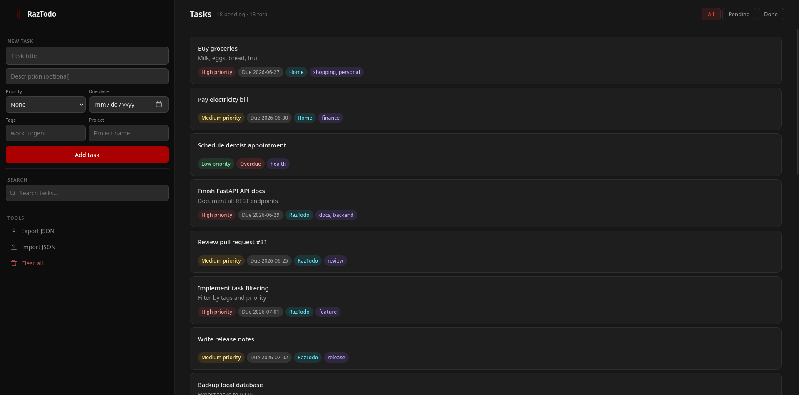

<div align="center">
  
  <br><br>

[](https://pypi.org/project/raztodo/)
[](https://pepy.tech/project/raztodo/)

[](https://github.com/razbuild/raztodo/actions/workflows/ci.yml)
[](https://codecov.io/gh/razbuild/raztodo)

[](https://pypi.org/project/raztodo/)

  <p>A modular task manager with a shared core, where CLI, web UI, and shell completion are optional components.</p>
</div>

---

## Preview

### CLI


### Web UI


<p align="center">
  <i>CLI + optional Web UI powered by FastAPI</i>
</p>

---

## Why RazTodo

RazTodo is a local-first task manager built around a shared core engine with optional interfaces (CLI, Web UI, and shell completion).

```
CLI ─┐
     ├── Core Engine ─── SQLite
Web ─┘
```

All interfaces share a single SQLite database, enabling instant synchronization without external services or accounts.

The design follows three principles:
- Separation of concerns — core logic is interface-agnostic  
- Local-first storage — all data remains on the user’s machine  
- Composable interfaces — CLI, Web UI, and shell tooling are optional layers

---

## Quick Start

### CLI

```bash
# Add a task
rt add "Prepare weekly groceries" --priority H --due 2026-12-31

# List all tasks
rt list

# Mark as done
rt done 1

# Search
rt search "groceries"

# Update
rt update 1 --title "Weekly groceries: milk, vegetables, essentials"

# Delete
rt remove 1
```

### Web UI

#### Start the server:

```bash
rt-web
```
Then open `http://127.0.0.1:8000`.

> [!NOTE]
> Runs locally only (not exposed to the internet)  
> Single-user design with no authentication layer  
> CLI and Web UI share one SQLite database (real-time sync)  
> Local-first architecture optimized for personal use  
> Built with FastAPI + lightweight static frontend

### Shell Completion

```bash
# Requires raztodo[completion]
eval "$(rt completion bash)"
```

Supports bash, zsh, and fish. For permanent setup see the [Completion Guide](https://github.com/razbuild/raztodo/blob/master/docs/COMPLETION.md).

---

## Installation

```bash
# Recommended (pipx)
pipx install raztodo

# No-install (uv)
uvx --from raztodo rt

# Standard install
pip install raztodo

# Web UI (optional)
pip install "raztodo[web]"

# Shell completion (optional)
pip install "raztodo[completion]"
```
For virtual environment and source installation, see the [Installation Guide](https://github.com/razbuild/raztodo/blob/master/docs/INSTALLATION.md)

---

## Commands

| Command      | Description                            | Example                             |
|--------------|----------------------------------------|-------------------------------------|
| `add`        | Create a new task                      | `rt add "Task" --priority H`        |
| `list`       | List tasks with filters                | `rt list --pending --priority H`    |
| `update`     | Update a task                          | `rt update 1 --title "New title"`   |
| `done`       | Toggle task done/undone                | `rt done 1`                         |
| `remove`     | Delete a task                          | `rt remove 1`                       |
| `search`     | Search tasks by keyword                | `rt search "keyword"`               |
| `export`     | Export tasks to JSON                   | `rt export backup.json`             |
| `import`     | Import tasks from JSON                 | `rt import backup.json`             |
| `migrate`    | Run database migrations                | `rt migrate`                        |
| `clear`      | Delete all tasks                       | `rt clear --confirm`                |
| `completion` | Output shell completion script         | `rt completion bash`                |

```bash
rt --help
rt add --help
```

📖 See the [Usage Guide](https://github.com/razbuild/raztodo/blob/master/docs/USAGE.md) for full command documentation.

---

## Configuration

| Variable     | Description                   | Default    |
|--------------|-------------------------------|------------|
| `RAZTODO_DB` | Database filename or path     | `tasks.db` |
| `LOG_LEVEL`  | Logging level                 | `ERROR`    |

```bash
export RAZTODO_DB="/path/to/custom.db"
export LOG_LEVEL="DEBUG"
```

> [!TIP]
> 📖 See the [Configuration Guide](https://github.com/razbuild/raztodo/blob/master/docs/CONFIGURATION.md)

---

## Docker
```bash
docker build -t raztodo:local .
docker run --rm -it -v "$HOME/raztodo-data:/data" raztodo:local add "My first task"
```
> [!NOTE]
> kept CLI-only to minimize image size and dependencies

> [!TIP]
> 📖 See the [Docker Guide](https://github.com/razbuild/raztodo/blob/master/docs/DOCKER.md)

---

## Documentation

Core:
  - 📦 [Installation Guide](https://github.com/razbuild/raztodo/blob/master/docs/INSTALLATION.md)
  - 📖 [Usage Guide](https://github.com/razbuild/raztodo/blob/master/docs/USAGE.md)
  - ⚙️ [Configuration Guide](https://github.com/razbuild/raztodo/blob/master/docs/CONFIGURATION.md)

Advanced:
  - ⌨️ [Completion Guide](https://github.com/razbuild/raztodo/blob/master/docs/COMPLETION.md)
  - 🐳 [Docker Guide](https://github.com/razbuild/raztodo/blob/master/docs/DOCKER.md)
  - 🏗️ [Architecture](https://github.com/razbuild/raztodo/blob/master/docs/ARCHITECTURE.md)
  - 🧪 [Testing](https://github.com/razbuild/raztodo/blob/master/docs/TESTING.md)
  - 📝 [Changelog](https://github.com/razbuild/raztodo/blob/master/CHANGELOG.md)

---

## Ecosystem

RazTodo is part of the [RazBuild](https://github.com/razbuild) ecosystem of open-source developer tools.

- [RazTint](https://github.com/razbuild/raztint) — Zero-dependency ANSI colors, icons, and terminal formatting utilities powering RazTodo's CLI output.

---

## Contributing

```bash
git clone https://github.com/razbuild/raztodo
cd raztodo
uv sync
```

## Quality checks

```
uv run pytest
uv run ruff check src/ tests/
uv run ruff format src/ tests/
uv run ty check src/
```

## Workflow

1. Create feature branch
2. Implement changes
3. Ensure tests pass
4. Submit PR

See [CONTRIBUTING](https://github.com/razbuild/.github/blob/main/CONTRIBUTING.md) guide for details.

---

## License

[](https://github.com/razbuild/raztodo/blob/master/LICENSE)

<div align="center">
  
</div>
