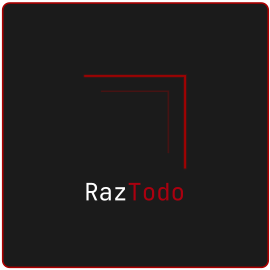

<div align="center">
  
  <br>

[](https://github.com/razbuild/raztodo/blob/master/LICENSE)
[](https://pypi.org/project/raztodo/)
[](https://github.com/razbuild/raztodo/actions/workflows/ci.yml)
[](https://codecov.io/gh/razbuild/raztodo)
[](https://pypi.org/project/raztodo/)
[](https://pepy.tech/project/raztodo)

  <p>A lightweight, cross-platform, privacy-first CLI task manager powered by SQLite.</p>
</div>

---

<p align="center">
  
</p>

---

## Why RazTodo?

**Lightweight & Fast** — Minimal dependencies, SQLite-powered, optimized for speed  
**Privacy-First** — Your data stays local, no cloud services, no tracking  
**Developer-Friendly** — Clean Architecture, well-tested, type-safe, modern Python  
**Simple & Powerful** — Intuitive CLI, works out of the box, rich features  
**Cross-Platform** — Works seamlessly on Linux, macOS, and Windows  

**Perfect for developers, power users, and anyone who wants a fast, reliable, local-first task manager.**

---

## Ecosystem

RazTodo is part of the [RazBuild](https://github.com/razbuild) ecosystem of open-source developer tools.

- [RazTint](https://github.com/razbuild/raztint) — Zero-dependency ANSI colors, icons, and terminal formatting utilities powering RazTodo's CLI experience.

---

## Quick Start

### Installation

```bash
# Recommended: Install via pipx (isolated environment)
pipx install raztodo

# Alternative: Install via pip
pip install raztodo

# Install the optional web UI
pip install "raztodo[web]"
```

> The base install provides the CLI. Install `raztodo[web]` if you also want the `rt-web` command.
>
> 📖 For more installation options (virtual environments, from source), see the [Installation Guide](https://github.com/razbuild/raztodo/blob/master/docs/INSTALLATION.md)

### Basic Usage

```bash
# Create a task with priority and due date
rt add "Buy groceries" --priority H --due 2024-12-31

# List all tasks
rt list

# Mark task as done
rt done 1

# Search for tasks
rt search "groceries"

# Update a task
rt update 1 --title "Buy groceries and milk"

# Delete a task
rt remove 1
```

### Shell Completion

`rt` supports native `<Tab>` completion for bash, zsh and fish.
For bash/zsh completion support, install the optional extra first:

```bash
pip install "raztodo[completion]"
```

**Quick activation (bash/zsh):**
```bash
eval "$(rt completion bash)"
```
**Now try:**
```bash
rt <Tab>
rt add --<Tab>
```

> 📖 For permanent setup and other shells (zsh, fish), see the [Completion Guide](https://github.com/razbuild/raztodo/blob/master/docs/COMPLETION.md)

---

### Docker (Optional)

RazTodo can also be run as a Docker container for isolated or portable usage.

```bash
# Build the image
docker build -t raztodo:local .

# Add a task
docker run --rm -it -v "$HOME/raztodo-data:/data" raztodo:local add "My first docker task"
```

> 📖 For Docker usage and persistence details, see the [Docker Guide](https://github.com/razbuild/raztodo/blob/master/docs/DOCKER.md)

---

## Features

- 📝 **Task Management** — Create, update, delete, and organize tasks
- 🏷️ **Tags & Projects** — Organize tasks with tags and project names
- 🔍 **Search** — Search task titles and descriptions with optional filters
- 📅 **Due Dates & Priority** — Set deadlines and priority levels (L/M/H)
- 💾 **Import/Export** — Backup and restore tasks via JSON
- 🎨 **Colored Output** — Beautiful ANSI colors and icons
- 🗄️ **SQLite Storage** — No external services required
- 🚀 **Cross-Platform** — Works on Linux, macOS, and Windows
- ⚡ **Fast Performance** — Lazy loading and optimized architecture
- 🏗️ **Clean Architecture** — Maintainable and testable codebase
- ✨ **Shell Autocompletion** — Tab completion for bash, zsh, and fish

---

## Commands

| Command   | Description              | Example                            |
|-----------|--------------------------|------------------------------------|
| `add`     | Create a new task        | `rt add "Task title" --priority H` |
| `list`    | List tasks with filters  | `rt list --pending --priority H`   |
| `update`  | Update a task            | `rt update 1 --title "New title"`  |
| `done`    | Mark task as done/undone | `rt done 1`                        |
| `remove`  | Delete a task            | `rt remove 1`                      |
| `search`  | Search tasks             | `rt search "keyword"`              |
| `export`  | Export to JSON           | `rt export backup.json`            |
| `import`  | Import from JSON         | `rt import backup.json`            |
| `migrate` | Run database migration   | `rt migrate`                       |
| `clear`   | Delete all tasks         | `rt clear --confirm`               |
| `completion` | Output shell completion script | `rt completion bash` |

```bash
# Get help for any command
rt --help
rt add --help
```

> 📖 See the [Usage Guide](https://github.com/razbuild/raztodo/blob/master/docs/USAGE.md) for detailed command documentation

---

## Configuration

RazTodo can be configured using environment variables:

| Variable     | Description               | Default    |
|--------------|---------------------------|------------|
| `RAZTODO_DB` | Database filename or path | `tasks.db` |
| `LOG_LEVEL`  | Logging level             | `ERROR`    |

**Example:**

```bash
# Use a custom database location
export RAZTODO_DB="/path/to/custom.db"

# Enable debug logging
export LOG_LEVEL="DEBUG"
```

> 📖 For detailed configuration options, see the [Configuration Guide](https://github.com/razbuild/raztodo/blob/master/docs/CONFIGURATION.md)

---

## Documentation

Complete documentation is available in the `docs/` directory:

- 📦 **[Installation Guide](https://github.com/razbuild/raztodo/blob/master/docs/INSTALLATION.md)** — Install via pip, pipx, or from source
- ⌨️ **[Completion Guide](https://github.com/razbuild/raztodo/blob/master/docs/COMPLETION.md)** — Shell completion setup for bash, zsh, fish, and more
- 🐳 **[Docker Guide](https://github.com/razbuild/raztodo/blob/master/docs/DOCKER.md)** — Run RazTodo using Docker with volume persistence
- 📖 **[Usage Guide](https://github.com/razbuild/raztodo/blob/master/docs/USAGE.md)** — Complete command reference with examples
- ⚙️ **[Configuration Guide](https://github.com/razbuild/raztodo/blob/master/docs/CONFIGURATION.md)** — Environment variables and options
- 🏗️ **[Architecture](https://github.com/razbuild/raztodo/blob/master/docs/ARCHITECTURE.md)** — Project structure and design patterns
- 🧪 **[Testing](https://github.com/razbuild/raztodo/blob/master/docs/TESTING.md)** — Running tests and development setup
- 📝 **[Changelog](https://github.com/razbuild/raztodo/blob/master/CHANGELOG.md)** — Release notes and version history

---

## Contributing

Contributions are welcome! Here's how you can help:

1. **Fork the repository**
2. **Create a feature branch**: `git checkout -b feature/your-feature-name`
3. **Make your changes** and ensure quality:
   ```bash
   # Run tests
   uv run pytest

   # Check code quality
   uv run ruff format --check src/ tests/
   uv run ruff check src/ tests/
   uv run ty check src/
   ```
4. **Submit a pull request**

For detailed guidelines, see the shared [RazBuild contributing guide](https://github.com/razbuild/.github/blob/main/CONTRIBUTING.md).

---

## License

MIT License

<div align="center">
  
</div>
