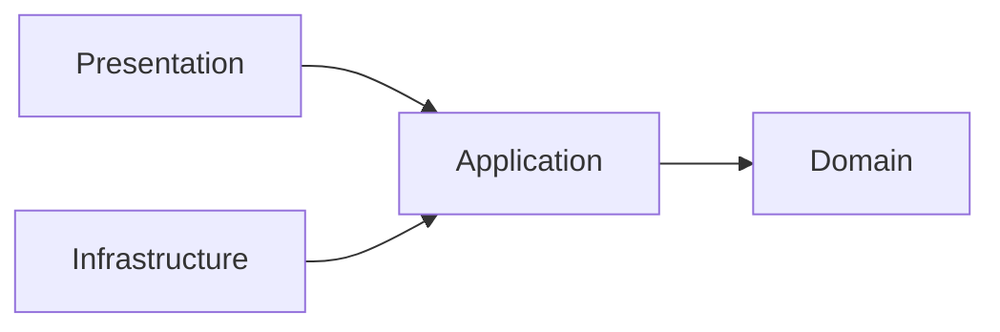
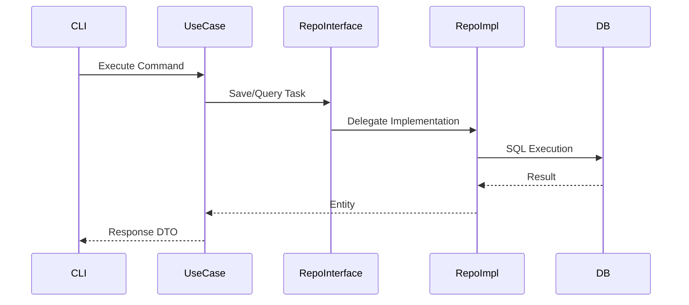

# Architecture

This project follows **Clean Architecture** to ensure that core business logic remains **independent** from frameworks, infrastructure, and delivery mechanisms. This approach improves:

- **Testability**  
- **Maintainability**  
- **Long-term extensibility**

---

## Overview of Layers

| Layer | Responsibility |
|-------|----------------|
| **Domain** | Core business rules, entities, and abstractions. Fully independent. |
| **Application** | Use Cases orchestrating domain logic via repository interfaces. Handles operational workflows. |
| **Infrastructure** | Technical implementations: database, logging, configuration, external services. |
| **Presentation** | User-facing interfaces (CLI). Handles input/output. |

**Dependency Direction:** All dependencies point **inward**. Outer layers depend on inner layers; inner layers never depend on outer layers.

---

## Dependency Rule



- **Domain:** depends on nothing.  
- **Application:** depends only on Domain.  
- **Presentation:** depends on Application (indirectly uses Domain via Application).  
- **Infrastructure:** depends on Application; may reference Domain for DTOs, entities, or mapping, but **never depends on Presentation** for business logic.

> **Notes:**  
> - Some Use Cases (e.g., migrations) may call Infrastructure utilities for technical tasks.  
> - Infrastructure may reference Presentation components strictly for dependency injection (no business logic).

---

## Data Flow (End-to-End)



**Flow Explanation:**

1. User sends input via CLI.  
2. Presentation parses & routes the command to the correct Use Case.  
3. Use Case executes business logic using repository interfaces.  
4. Infrastructure persists data & provides concrete implementations.  
5. Response flows back to the user through the same layers.

---

## Project Structure

```
src/
└── raztodo/
    ├── application/
    │   └── use_cases/
    ├── domain/
    ├── infrastructure/
    │   └── sqlite/
    ├── presentation/
    │   └── cli/
    ├── __main__.py
```

---

## Application Layer

**Directory:** [application/](https://github.com/razbuild/raztodo/blob/master/src/raztodo/application/)  
Contains **Use Cases** coordinating domain logic.

### Use Cases

| File | Purpose | Input / Output |
|------|---------|----------------|
| `create_task.py` | Create a new task | Input: task data; Output: Task |
| `delete_task.py` | Delete a task | Input: task ID; Output: success/failure |
| `update_task.py` | Update task details | Input: task ID + data; Output: Task |
| `list_tasks.py` | Retrieve all tasks | Output: list of Tasks |
| `search_tasks.py` | Search tasks | Input: criteria; Output: Tasks |
| `mark_task_done.py` | Mark a task completed | Input: task ID; Output: Task |
| `import_task.py` | Import tasks | Input: file; Output: Tasks |
| `export_task.py` | Export tasks | Input: criteria; Output: file |
| `migrate_tasks.py` | Handle DB migrations | Input: commands; Output: status |

> Fully testable independently from Presentation & Infrastructure.

---

## Domain Layer

**Directory:** [domain/](https://github.com/razbuild/raztodo/blob/master/src/raztodo/domain/)
Contains **core business logic**.

- `task_entity.py` – Task entity & rules  
- `exceptions.py` – Domain-specific exceptions  
- `task_repository.py` – Repository interface

---

## Infrastructure Layer

**Directory:** [infrastructure/](/https://github.com/razbuild/raztodo/blob/master/src/raztodo/infrastructure/)
Provides concrete implementations: DB, logging, configuration.

- `container.py` – Dependency injection  
- `logger.py` – Logging setup  
- `settings.py` – Config/env variables  

### SQLite Implementation

- `connection.py` – DB manager  
- `task_schema.py` – DB schema  
- `migrations.py` – Migration utilities  
- `task_dao.py` – Data access object  
- `task_mapper.py` – Domain ↔ DB mapping  
- `task_repository.py` – Repository implementation

---

## Presentation Layer

**Directory:** [presentation/cli/](https://github.com/razbuild/raztodo/blob/master/src/raztodo/presentation/cli/)  
Handles **CLI user interaction**.

- `entrypoint.py` – CLI entry point  
- `parser.py` – Argument parsing  
- `router.py` – Routes commands  
- `formatters.py` – Output formatting  
- `helpers.py` – Utility functions
- `ansi.py`  - Support ANSI color and Icon

### Commands

| Command File | Purpose |
|--------------|---------|
| `create_task_cmd.py` | Add task |
| `delete_task_cmd.py` | Delete task |
| `update_task_cmd.py` | Update task |
| `list_tasks_cmd.py` | List all tasks |
| `search_tasks_cmd.py` | Search tasks |
| `mark_task_done_cmd.py` | Mark completed |
| `import_task_cmd.py` | Import tasks |
| `export_task_cmd.py` | Export tasks |
| `migrate_tasks_cmd.py` | DB migrations

---

## Entry Point

**File:** `__main__.py`

```bash
rt add "Task1" --desc "Test1"
rt list
rt --help
```

> Not intended for direct execution during development.

---

## Conclusion

- Separation of concerns makes the code **maintainable** & **testable**.  
- Developers can extend functionality without affecting business rules.  

**Future enhancements:**

- Add new CLI commands or Web API interface  
- Support additional DB backends  
- Implement automated tests for all Use Cases

