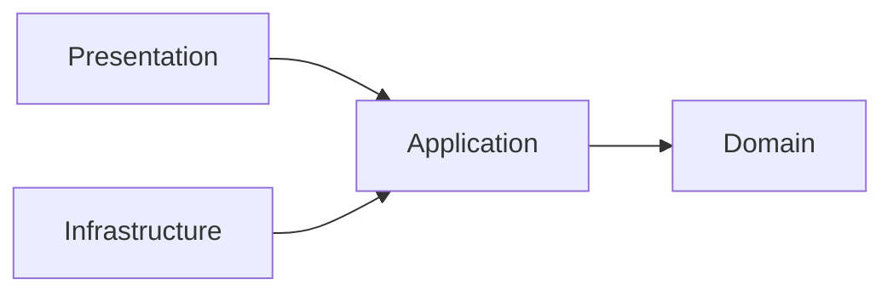
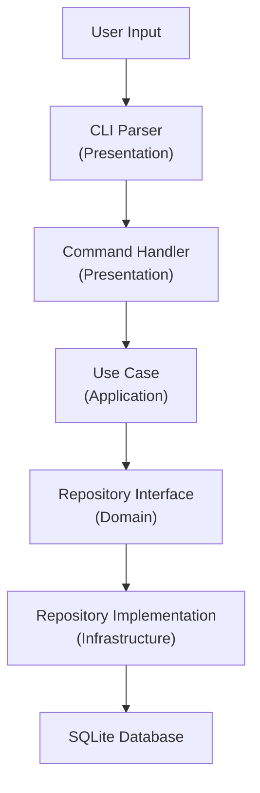

# Architecture

This project follows **Clean Architecture** (Hexagonal / Ports and Adapters) to ensure that core business logic remains independent from frameworks, infrastructure, and delivery mechanisms. This structure improves **testability**, **maintainability**, and **long-term extensibility**.

---

## Overview

| Layer | Responsibility |
|-------|----------------|
| **Domain** | Pure business rules, entities, and abstractions. Completely independent of other layers. |
| **Application** | Use Cases orchestrating domain logic through repository interfaces. Contains operational workflows. |
| **Infrastructure** | Technical implementations such as database persistence, logging, configuration, and external services. |
| **Presentation** | User-facing interfaces (CLI). Handles user input/output. |

**Dependency Direction:** All dependencies point **inward**. Outer layers depend on inner layers; inner layers never depend on outer layers.

---

## Dependency Rule


```mermaid
flowchart LR
    Presentation --> Application
    Application --> Domain
    Infrastructure --> Application
    %% Optional: Infrastructure may use Domain types for mapping purposes or wiring
```

- **Domain**: depends on nothing.  
- **Application**: depends only on Domain.  
- **Presentation**: depends on Application (and indirectly uses Domain via Application).  
- **Infrastructure**: depends on Application; may reference Domain for DTOs, entities, or mapping, but **never depends on Presentation** for business logic.

> **Notes:**
> - Some Use Cases, like database migrations, may call Infrastructure utilities (e.g., `migrations.py`) for technical operations. These operations do not contain business logic and are an acceptable exception to strict layer dependency rules.
> - Infrastructure may reference Presentation components for wiring purposes (like `TaskRouter` in `AppContainer`). This does **not** introduce business logic dependency on Presentation; it's strictly for dependency injection.

---

## Data Flow (End-to-End)


```mermaid
flowchart TD
    UserInput["User Input"]
    Parser["CLI Parser<br/>(Presentation)"]
    Handler["Command Handler<br/>(Presentation)"]
    UseCase["Use Case<br/>(Application)"]
    RepoIface["Repository Interface<br/>(Domain)"]
    RepoImpl["Repository Implementation<br/>(Infrastructure)"]
    DB["SQLite Database"]

    UserInput --> Parser --> Handler --> UseCase --> RepoIface --> RepoImpl --> DB
```

**Explanation:**  
1. User sends input via CLI.  
2. Presentation parses and routes the command to the correct Use Case.  
3. Use Case executes business logic using repository interfaces.  
4. Infrastructure provides concrete repository implementations and persists data.  
5. Response flows back through the same layers to the user.

---

## Project Structure

```
src/
└── raztodo/
    ├── application/
    │   └── use_cases/
    ├── domain/
    ├── infrastructure/
    │   └── sqlite/
    ├── presentation/
    │   └── cli/
    ├── __main__.py
```

---

## 1. Application Layer

**Directory:** `application/`  
Contains **Use Cases**—isolated operations coordinating Domain logic.

### Use Cases

| File | Purpose | Input / Output |
|------|---------|----------------|
| `create_task.py` | Creates a new task | Input: task data; Output: created Task |
| `delete_task.py` | Deletes a task by ID | Input: task ID; Output: success/failure |
| `update_task.py` | Updates task details | Input: task ID + new data; Output: updated Task |
| `list_tasks.py` | Retrieves all tasks | Output: list of Tasks |
| `search_tasks.py` | Searches for tasks | Input: search criteria; Output: matching Tasks |
| `mark_task_done.py` | Marks a task as completed | Input: task ID; Output: updated Task |
| `import_task.py` | Imports tasks | Input: external file; Output: imported Tasks |
| `export_task.py` | Exports tasks | Input: criteria; Output: external file |
| `migrate_tasks.py` | Handles database migrations | Input: migration commands; Output: migration status |

> Each Use Case is fully testable independently from Presentation and Infrastructure, except for migration-related utilities that interface with Infrastructure scripts.

---

## 2. Domain Layer

**Directory:** `domain/`  
Contains **core business logic and entities**. Independent of frameworks, DB, or CLI.

- `task_entity.py` – Task entity and business rules  
- `exceptions.py` – Domain-specific exceptions  
- `task_repository.py` – Repository interface (contract for storage)

---

## 3. Infrastructure Layer

**Directory:** `infrastructure/`  
Provides concrete implementations for repositories, persistence, logging, and configuration.

- `container.py` – Dependency injection / service wiring  
- `logger.py` – Logging configuration  
- `settings.py` – Config/environment settings  

### SQLite Implementation

- `connection.py` – DB connection manager  
- `task_schema.py` – Database schema  
- `migrations.py` – Migration utilities  
- `task_dao.py` – Data access object  
- `task_mapper.py` – Mapping between Domain and DB models  
- `task_repository.py` – Implementation of TaskRepository interface

---

## 4. Presentation Layer

**Directory:** `presentation/cli/`  
Handles **user interaction via CLI**.

- `entrypoint.py` – CLI entry point  
- `parser.py` – Argument parsing  
- `router.py` – Routes commands to Use Cases  
- `formatters.py` – Output formatting  
- `helpers.py` – Utility functions  

### Commands

| Command File | Purpose |
|--------------|---------|
| `create_task_cmd.py` | Add a task |
| `delete_task_cmd.py` | Delete a task |
| `update_task_cmd.py` | Update task details |
| `list_tasks_cmd.py` | List all tasks |
| `search_tasks_cmd.py` | Search tasks |
| `mark_task_done_cmd.py` | Mark as completed |
| `import_task_cmd.py` | Import tasks |
| `export_task_cmd.py` | Export tasks |
| `migrate_tasks_cmd.py` | Database migrations |

---

## 5. Entry Point

**File:** `__main__.py`  

CLI is exposed via `pyproject.toml` console script:

```bash
raztodo add "Task1" --desc "Test1"
raztodo list
raztodo --help
```

> `__main__.py` is not intended for direct execution during development.

---

## 6. Testing Strategy

- **Unit Tests:** Target Domain and Application layers  
- **Integration Tests:** Cover Use Cases + Infrastructure  
- **CLI Tests:** Ensure Presentation layer maps correctly to Use Cases

---

This document provides a **comprehensive, maintainable, and testable architecture reference** for developers joining the project, with clear notes on acceptable exceptions to strict layer separation rules.

