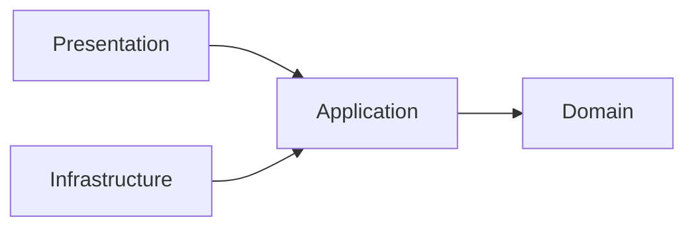
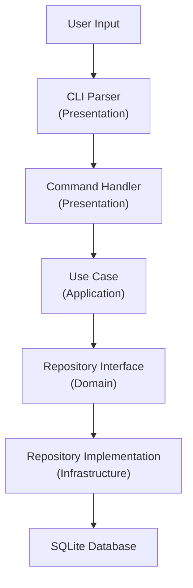

# Architecture

This project is structured according to **Clean Architecture** to ensure that core business logic remains independent from frameworks, infrastructure, and delivery mechanisms. This design improves **testability**, **maintainability**, and **long-term extensibility**.

---

## Overview

| Layer | Responsibility |
|-------|----------------|
| **Domain** | Contains pure business rules, entities, and abstractions. Fully independent of other layers. |
| **Application** | Orchestrates domain logic through repository interfaces. Implements operational workflows (Use Cases). |
| **Infrastructure** | Implements technical details such as database access, logging, configuration, and external services. |
| **Presentation** | Provides user-facing interfaces (CLI) and handles input/output. |

**Dependency Rule:** All dependencies point **inward**. Outer layers depend on inner layers; inner layers never depend on outer layers.

---

## Dependency Rule Diagram


```mermaid
flowchart LR
    Presentation --> Application
    Application --> Domain
    Infrastructure --> Application
    %% Optional: Infrastructure may use Domain types for mapping purposes
```

- **Domain:** depends on nothing.  
- **Application:** depends only on Domain.  
- **Presentation:** depends on Application (and indirectly uses Domain via Application).  
- **Infrastructure:** depends on Application; may reference Domain for DTOs or entities but **never depends on Presentation**.

> **Notes:**  
> - Some Use Cases, like database migrations, may call Infrastructure utilities (e.g., `migrations.py`) for technical operations. These do not contain business logic.  
> - Infrastructure may reference Presentation for wiring purposes (e.g., `TaskRouter` in `AppContainer`). This does **not** create a business logic dependency.

---

## Data Flow (End-to-End)


```mermaid
flowchart TD
    UserInput["User Input"]
    Parser["CLI Parser<br/>(Presentation)"]
    Handler["Command Handler<br/>(Presentation)"]
    UseCase["Use Case<br/>(Application)"]
    RepoIface["Repository Interface<br/>(Domain)"]
    RepoImpl["Repository Implementation<br/>(Infrastructure)"]
    DB["SQLite Database"]

    UserInput --> Parser --> Handler --> UseCase --> RepoIface --> RepoImpl --> DB
```

**Flow Explanation:**  
1. User sends input via CLI.  
2. Presentation parses and routes commands to the corresponding Use Case.  
3. Use Case executes business logic via repository interfaces.  
4. Infrastructure persists data and provides concrete repository implementations.  
5. Responses flow back through the same layers to the user.

---

## Project Structure

```
src/
└── raztodo/
    ├── application/
    │   └── use_cases/
    ├── domain/
    ├── infrastructure/
    │   └── sqlite/
    ├── presentation/
    │   └── cli/
    ├── __main__.py
```

---

## 1. Application Layer

**Directory:** `application/`  
Contains **Use Cases**—isolated operations coordinating Domain logic.

### Use Cases

| File | Purpose | Input / Output |
|------|---------|----------------|
| `create_task.py` | Create a new task | Input: task data; Output: Task |
| `delete_task.py` | Delete a task by ID | Input: task ID; Output: success/failure |
| `update_task.py` | Update task details | Input: task ID + new data; Output: Task |
| `list_tasks.py` | Retrieve all tasks | Output: list of Tasks |
| `search_tasks.py` | Search for tasks | Input: criteria; Output: Tasks |
| `mark_task_done.py` | Mark a task completed | Input: task ID; Output: Task |
| `import_task.py` | Import tasks | Input: file; Output: Tasks |
| `export_task.py` | Export tasks | Input: criteria; Output: file |
| `migrate_tasks.py` | Database migrations | Input: commands; Output: status |

> All Use Cases are fully testable independently from Presentation and Infrastructure.

---

## 2. Domain Layer

**Directory:** `domain/`  
Contains **core business logic and entities**, fully independent of frameworks, database, or CLI.

- `task_entity.py` – Task entity and business rules  
- `exceptions.py` – Domain-specific exceptions  
- `task_repository.py` – Repository interface

---

## 3. Infrastructure Layer

**Directory:** `infrastructure/`  
Provides concrete implementations for repositories, persistence, logging, and configuration.

- `container.py` – Dependency injection / wiring  
- `logger.py` – Logging setup  
- `settings.py` – Configuration and environment

### SQLite Implementation

- `connection.py` – DB connection manager  
- `task_schema.py` – Database schema  
- `migrations.py` – Migration utilities  
- `task_dao.py` – Data access object  
- `task_mapper.py` – Domain ↔ DB mapping  
- `task_repository.py` – TaskRepository implementation

---

## 4. Presentation Layer

**Directory:** `presentation/cli/`  
Handles **user interaction via CLI**.

- `entrypoint.py` – CLI entry point  
- `parser.py` – Argument parsing  
- `router.py` – Routes commands to Use Cases  
- `formatters.py` – Output formatting  
- `helpers.py` – Utilities

### Commands

| Command File | Purpose |
|--------------|---------|
| `create_task_cmd.py` | Add a task |
| `delete_task_cmd.py` | Delete a task |
| `update_task_cmd.py` | Update task |
| `list_tasks_cmd.py` | List tasks |
| `search_tasks_cmd.py` | Search tasks |
| `mark_task_done_cmd.py` | Mark completed |
| `import_task_cmd.py` | Import tasks |
| `export_task_cmd.py` | Export tasks |
| `migrate_tasks_cmd.py` | Run migrations |

---

## 5. Entry Point

**File:** `__main__.py`  

CLI usage via `pyproject.toml` console script:

```bash
raztodo add "Task1" --desc "Test1"
raztodo list
raztodo --help
```

> `__main__.py` is not meant for direct execution during development.

