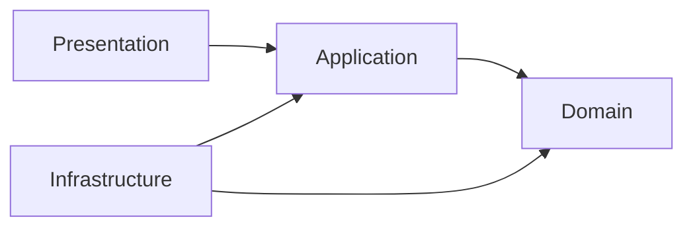
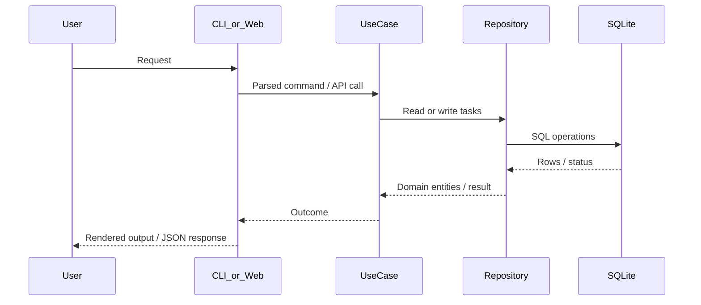

# Architecture

RazTodo follows a Clean Architecture style so the core task logic stays independent from delivery mechanisms such as the CLI and the optional web UI.

This improves:

- **Testability**
- **Maintainability**
- **Extensibility**

---

## Layer Overview

| Layer | Responsibility |
|-------|----------------|
| **Domain** | Core business rules, entities, and repository contracts |
| **Application** | Use cases that orchestrate task operations |
| **Infrastructure** | SQLite persistence, configuration, logging, and app wiring |
| **Presentation** | User-facing interfaces: CLI and optional FastAPI web UI |

Dependency direction points inward: presentation and infrastructure depend on application/domain, not the other way around.

---

## Dependency Rule


```mermaid
flowchart LR
    Presentation --> Application
    Infrastructure --> Application
    Application --> Domain
    Infrastructure --> Domain
```

Notes:

- The **Domain** layer has no dependency on outer layers.
- The **Application** layer depends on domain contracts and entities.
- The **Infrastructure** layer implements repository and persistence details.
- The **Presentation** layer translates user input into use-case calls and formats responses.

---

## End-to-End Flow


```mermaid
sequenceDiagram
    participant User
    participant CLI_or_Web
    participant UseCase
    participant Repository
    participant SQLite

    User->>CLI_or_Web: Request
    CLI_or_Web->>UseCase: Parsed command / API call
    UseCase->>Repository: Read or write tasks
    Repository->>SQLite: SQL operations
    SQLite-->>Repository: Rows / status
    Repository-->>UseCase: Domain entities / result
    UseCase-->>CLI_or_Web: Outcome
    CLI_or_Web-->>User: Rendered output / JSON response
```

---

## Project Structure

```text
src/
└── raztodo/
    ├── application/
    │   ├── use_case_factory.py
    │   └── use_cases/
    │       ├── clear_tasks.py
    │       ├── create_task.py
    │       ├── delete_task.py
    │       ├── export_task.py
    │       ├── import_task.py
    │       ├── list_tasks.py
    │       ├── mark_task_done.py
    │       ├── migrate_tasks.py
    │       ├── search_tasks.py
    │       └── update_task.py
    ├── domain/
    │   ├── exceptions.py
    │   ├── task_entity.py
    │   └── task_repository.py
    ├── infrastructure/
    │   ├── container.py
    │   ├── logger.py
    │   ├── settings.py
    │   └── sqlite/
    │       ├── connection.py
    │       ├── migrations.py
    │       ├── task_dao.py
    │       ├── task_mapper.py
    │       ├── task_repository.py
    │       └── task_schema.py
    ├── presentation/
    │   ├── cli/
    │   │   ├── commands/
    │   │   ├── entrypoint.py
    │   │   ├── formatters.py
    │   │   ├── helpers.py
    │   │   ├── parser.py
    │   │   ├── protocols.py
    │   │   └── router.py
    │   └── web/
    │       ├── __main__.py
    │       ├── app.py
    │       ├── dependencies.py
    │       ├── routes/
    │       │   └── tasks.py
    │       └── schemas.py
    └── __main__.py
```

---

## Domain Layer

**Directory:** `src/raztodo/domain/`

The domain layer defines the task model and abstract repository contract.

Key files:

- `task_entity.py` — task entity representation
- `task_repository.py` — repository interface used by use cases
- `exceptions.py` — domain exceptions surfaced to callers

---

## Application Layer

**Directory:** `src/raztodo/application/`

This layer contains the use cases that implement task operations.

| File | Purpose |
|------|---------|
| `create_task.py` | Create a task |
| `delete_task.py` | Delete a task |
| `list_tasks.py` | List tasks with filters |
| `update_task.py` | Update task fields |
| `search_tasks.py` | Search tasks |
| `mark_task_done.py` | Mark a task done/undone |
| `export_task.py` | Export tasks to JSON |
| `import_task.py` | Import tasks from JSON |
| `clear_tasks.py` | Delete all tasks |
| `migrate_tasks.py` | Run SQLite migrations |

`use_case_factory.py` provides lazy construction of these use cases for the CLI and web layers.

---

## Infrastructure Layer

**Directory:** `src/raztodo/infrastructure/`

This layer contains technical implementations.

Key files:

- `settings.py` — resolves the configured data directory and database path
- `logger.py` — configures loggers and log levels
- `container.py` — application/container wiring
- `sqlite/` — SQLite DAO, schema, repository implementation, and migrations

The default persistence backend is SQLite via `SQLiteTaskRepository`.

---

## Presentation Layer

### CLI

**Directory:** `src/raztodo/presentation/cli/`

The CLI handles argument parsing, command routing, human-readable output, and JSON output.

Important files:

- `parser.py` — top-level `argparse` setup
- `router.py` — maps command names to command handlers and use cases
- `entrypoint.py` — runs the CLI flow
- `commands/` — command-specific parsers and handlers

### Web UI / API

**Directory:** `src/raztodo/presentation/web/`

The optional web interface uses FastAPI.

Important files:

- `__main__.py` — launches the local Uvicorn server
- `app.py` — FastAPI app plus the embedded HTML UI
- `routes/tasks.py` — JSON API endpoints under `/api/tasks`
- `schemas.py` — request/response models
- `dependencies.py` — use-case wiring for the API layer

The web UI is optional and only available when RazTodo is installed with the `web` extra.

---

## Runtime Entry Points

- `rt` → `raztodo.__main__:main`
- `rt-web` → `raztodo.presentation.web.__main__:main`

`rt-web` starts a local server on `127.0.0.1:8000` by default.

---

## Testing Strategy

Tests mirror the architecture:

- `tests/application/`
- `tests/domain/`
- `tests/infrastructure/`
- `tests/presentation/cli/`
- `tests/presentation/web/`

This keeps behavior checks close to the layer they validate.

---

## Summary

RazTodo’s architecture separates task logic from storage and interface concerns:

- the **domain** models the problem,
- the **application** layer implements workflows,
- the **infrastructure** layer handles persistence/configuration,
- and the **presentation** layer exposes both CLI and web access.
