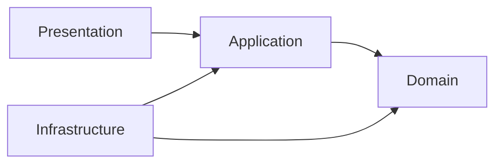
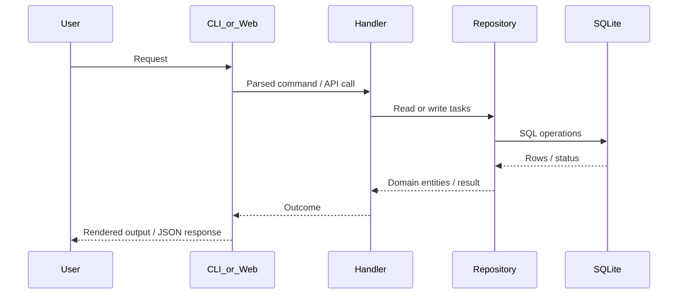
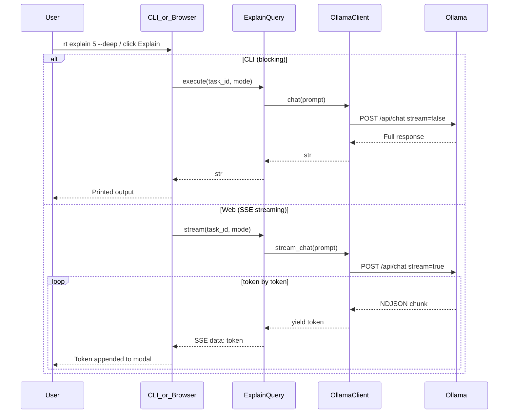

# Architecture

RazTodo follows a Clean Architecture style so the core task logic stays independent from delivery mechanisms such as the CLI and the optional web UI.

This improves:
- **Testability**
- **Maintainability**
- **Extensibility**

---

## Layer Overview

| Layer | Responsibility |
|-------|----------------|
| **Domain** | Core business rules, entities, and repository contracts |
| **Application** | Queries and use cases that orchestrate task operations |
| **Infrastructure** | SQLite persistence, LLM client, configuration, logging, and app wiring |
| **Presentation** | User-facing interfaces: CLI and optional FastAPI web UI |

Dependency direction points inward: presentation and infrastructure depend on application/domain, not the other way around.

---

## Dependency Rule


```mermaid
flowchart LR
    Presentation --> Application
    Infrastructure --> Application
    Application --> Domain
    Infrastructure --> Domain
```

Notes:
- The **Domain** layer has no dependency on outer layers.
- The **Application** layer depends on domain contracts and entities.
- The **Infrastructure** layer implements repository, persistence, and LLM integration details.
- The **Presentation** layer translates user input into query/use-case calls and formats responses.

---

## End-to-End Flow


```mermaid
sequenceDiagram
    participant User
    participant CLI_or_Web
    participant Handler
    participant Repository
    participant SQLite
    User->>CLI_or_Web: Request
    CLI_or_Web->>Handler: Parsed command / API call
    Handler->>Repository: Read or write tasks
    Repository->>SQLite: SQL operations
    SQLite-->>Repository: Rows / status
    Repository-->>Handler: Domain entities / result
    Handler-->>CLI_or_Web: Outcome
    CLI_or_Web-->>User: Rendered output / JSON response
```

---

## Project Structure

```text
src/
└── raztodo
    ├── application
    │   ├── factory.py
    │   ├── __init__.py
    │   ├── queries
    │   │   ├── explain_task.py
    │   │   ├── export_tasks.py
    │   │   ├── __init__.py
    │   │   ├── list_tasks.py
    │   │   └── search_tasks.py
    │   └── use_cases
    │       ├── clear_tasks.py
    │       ├── create_task.py
    │       ├── delete_task.py
    │       ├── import_tasks.py
    │       ├── __init__.py
    │       ├── mark_task_done.py
    │       ├── migrate_tasks.py
    │       └── update_task.py
    ├── domain
    │   ├── exceptions.py
    │   ├── __init__.py
    │   ├── task_entity.py
    │   └── task_repository.py
    ├── infrastructure
    │   ├── container.py
    │   ├── __init__.py
    │   ├── llm
    │   │   ├── client.py      # Ollama HTTP client (stdlib only)
    │   │   └── config.py      # LLM config loaded from llm.json
    │   ├── logger.py
    │   ├── settings.py
    │   ├── sqlite
    │   │   ├── connection.py
    │   │   ├── __init__.py
    │   │   ├── migrations.py
    │   │   ├── task_dao.py
    │   │   ├── task_mapper.py
    │   │   ├── task_repository.py
    │   │   └── task_schema.py
    │   └── version.py
    ├── __init__.py
    ├── __main__.py
    └── presentation
        ├── cli
        │   ├── entrypoint.py
        │   ├── formatters.py
        │   ├── handlers
        │   │   ├── clear_tasks_handler.py
        │   │   ├── completion.py
        │   │   ├── create_task_handler.py
        │   │   ├── delete_task_handler.py
        │   │   ├── explain_task_handler.py
        │   │   ├── export_task_handler.py
        │   │   ├── import_task_handler.py
        │   │   ├── __init__.py
        │   │   ├── list_tasks_handler.py
        │   │   ├── mark_task_done_handler.py
        │   │   ├── migrate_tasks_handler.py
        │   │   ├── search_tasks_handler.py
        │   │   └── update_task_handler.py
        │   ├── helpers.py
        │   ├── __init__.py
        │   ├── parser.py
        │   ├── protocols.py
        │   └── router.py
        ├── __init__.py
        └── web
            ├── app.py
            ├── dependencies.py
            ├── __init__.py
            ├── __main__.py
            ├── routes
            │   ├── explain.py      # SSE streaming endpoint for LLM explain
            │   ├── __init__.py
            │   └── tasks.py
            ├── schemas.py
            ├── static
            │   ├── css
            │   │   └── style.css
            │   ├── img
            │   │   └── favicon.ico
            │   └── js
            │       └── app.js
            └── templates
                └── index.html
```

---

## Domain Layer

**Directory:** `src/raztodo/domain/`

The domain layer defines the task model and abstract repository contract.

Key files:
- `task_entity.py`: task entity representation
- `task_repository.py`: repository interface used by queries and use cases
- `exceptions.py`: domain exceptions surfaced to callers

---

## Application Layer

**Directory:** `src/raztodo/application/`

This layer implements task operations, split into two categories by intent:

- **`queries/`**: read-only operations that don't mutate state
- **`use_cases/`**: operations that create, modify, or delete state

### Queries

**Directory:** `src/raztodo/application/queries/`

| File | Purpose |
|------|---------|
| `list_tasks.py` | List tasks with filters |
| `search_tasks.py` | Search tasks |
| `export_tasks.py` | Export tasks to JSON |
| `explain_task.py` | Explain or plan a task via Ollama |

### Use Cases

**Directory:** `src/raztodo/application/use_cases/`

| File | Purpose |
|------|---------|
| `create_task.py` | Create a task |
| `delete_task.py` | Delete a task |
| `update_task.py` | Update task fields |
| `mark_task_done.py` | Mark a task done/undone |
| `import_tasks.py` | Import tasks from JSON |
| `clear_tasks.py` | Delete all tasks |
| `migrate_tasks.py` | Run SQLite migrations |

`factory.py` provides lazy construction of these queries and use cases for the CLI and web layers.

---

## Infrastructure Layer

**Directory:** `src/raztodo/infrastructure/`

This layer contains technical implementations.

Key files and directories:
- `settings.py`: resolves the configured data directory and database path
- `logger.py`: configures loggers and log levels
- `container.py`: application/container wiring
- `sqlite/`: SQLite DAO, schema, repository implementation, and migrations
- `llm/`: optional LLM integration via Ollama (zero external dependencies)

### LLM sub-package

**Directory:** `src/raztodo/infrastructure/llm/`

Encapsulates all Ollama communication. Uses only Python stdlib (`http.client`, `urllib.parse`) so no extra packages are required.

| File | Purpose |
|------|---------|
| `config.py` | Loads and persists LLM settings from `llm.json` in the data directory |
| `client.py` | `chat()` (blocking, used by CLI) and `stream_chat()` (token generator, used by web SSE endpoint) |

Config file location follows the same platform logic as `settings.py`:

| Platform | Path |
|----------|------|
| Linux / BSD | `~/.local/share/raztodo/llm.json` |
| macOS | `~/Library/Application Support/raztodo/llm.json` |
| Windows | `%APPDATA%\raztodo\llm.json` |

No model is set by default: the user must configure one explicitly:

```bash
rt explain --config --model mistral
```

Environment variables (`OLLAMA_HOST`, `OLLAMA_MODEL`, `OLLAMA_TIMEOUT`) override the config file.

---

## Presentation Layer

### CLI

**Directory:** `src/raztodo/presentation/cli/`

The CLI handles argument parsing, command routing, human-readable output, and JSON output.

Important files:
- `parser.py`: top-level `argparse` setup
- `router.py`: maps command names to command handlers, which in turn call queries/use cases
- `entrypoint.py`: runs the CLI flow
- `handlers/`: command-specific parsers and handlers, including `explain_task_handler.py`. Each handler is named after the query/use case it invokes (e.g. `create_task_handler.py`), except `completion.py`, which implements shell completion and isn't tied to a single query/use case.

### Web UI / API

**Directory:** `src/raztodo/presentation/web/`

Optional FastAPI-based web interface (API + lightweight frontend).

Important files:
- `__main__.py`: launches the local Uvicorn server
- `app.py`: FastAPI application setup, router registration, and static/template configuration
- `dependencies.py`: query/use-case wiring for the API layer
- `static/`: frontend assets (JavaScript, CSS)
- `templates/`: HTML templates
- `routes/tasks.py`: JSON API endpoints under `/api/tasks`
- `routes/explain.py`: SSE streaming endpoint (`GET /api/tasks/{id}/explain`) that streams Ollama tokens to the browser as they arrive
- `schemas.py`: request/response models

The web layer is split into two logical parts:
- **API layer**: FastAPI routes and schemas handling JSON-based task operations and LLM streaming
- **Frontend layer**: static assets and HTML; the explain modal renders tokens progressively via `fetch` + `ReadableStream`

The web UI is optional and only available when RazTodo is installed with the `web` extra.

---

## LLM Explain Flow


```mermaid
sequenceDiagram
    participant User
    participant CLI_or_Browser
    participant ExplainQuery
    participant OllamaClient
    participant Ollama

    User->>CLI_or_Browser: rt explain 5 --deep  /  click Explain

    alt CLI (blocking)
        CLI_or_Browser->>ExplainQuery: execute(task_id, mode)
        ExplainQuery->>OllamaClient: chat(prompt)
        OllamaClient->>Ollama: POST /api/chat  stream=false
        Ollama-->>OllamaClient: Full response
        OllamaClient-->>ExplainQuery: str
        ExplainQuery-->>CLI_or_Browser: str
        CLI_or_Browser-->>User: Printed output
    else Web (SSE streaming)
        CLI_or_Browser->>ExplainQuery: stream(task_id, mode)
        ExplainQuery->>OllamaClient: stream_chat(prompt)
        OllamaClient->>Ollama: POST /api/chat  stream=true
        loop token by token
            Ollama-->>OllamaClient: NDJSON chunk
            OllamaClient-->>ExplainQuery: yield token
            ExplainQuery-->>CLI_or_Browser: SSE data: token
            CLI_or_Browser-->>User: Token appended to modal
        end
    end
```

---

## Runtime Entry Points

- `rt` → `raztodo.__main__:main`
- `rt-web` → `raztodo.presentation.web.__main__:main`

`rt-web` starts a local server on `127.0.0.1:8000` by default.

---

## Testing Strategy

Tests mirror the architecture:

- `tests/application/queries/`
- `tests/application/use_cases/`
- `tests/domain/`
- `tests/infrastructure/`
- `tests/presentation/cli/`
- `tests/presentation/web/`

This keeps behavior checks close to the layer they validate.

---

## Summary

RazTodo's architecture separates task logic from storage and interface concerns:

- the domain models the problem space
- the application layer orchestrates workflows, split into read-only **queries** and mutating **use cases**
- the infrastructure layer handles persistence and LLM integration
- the presentation layer handles CLI and HTTP/API + web UI rendering